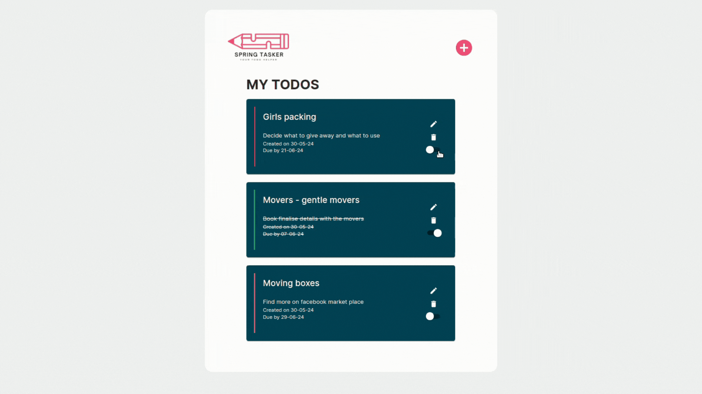
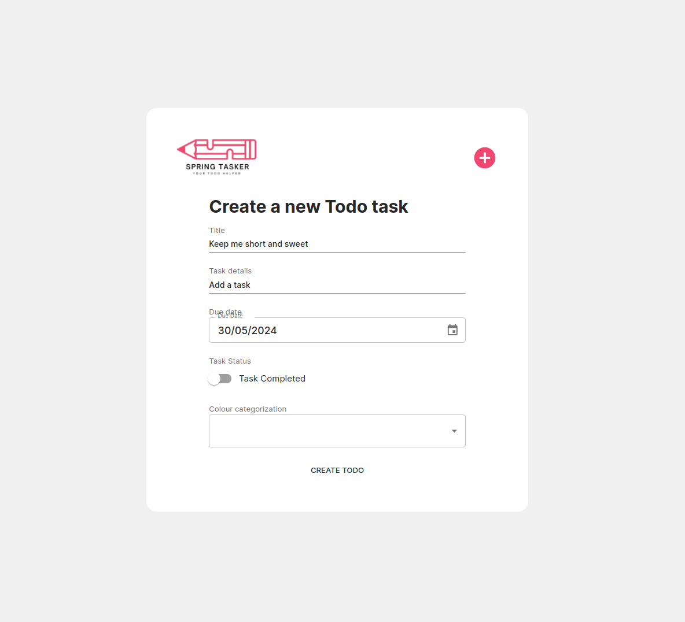
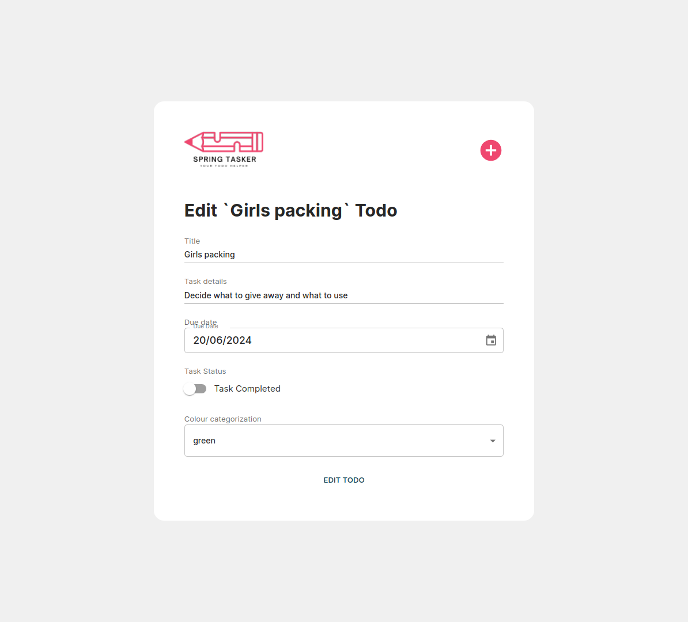
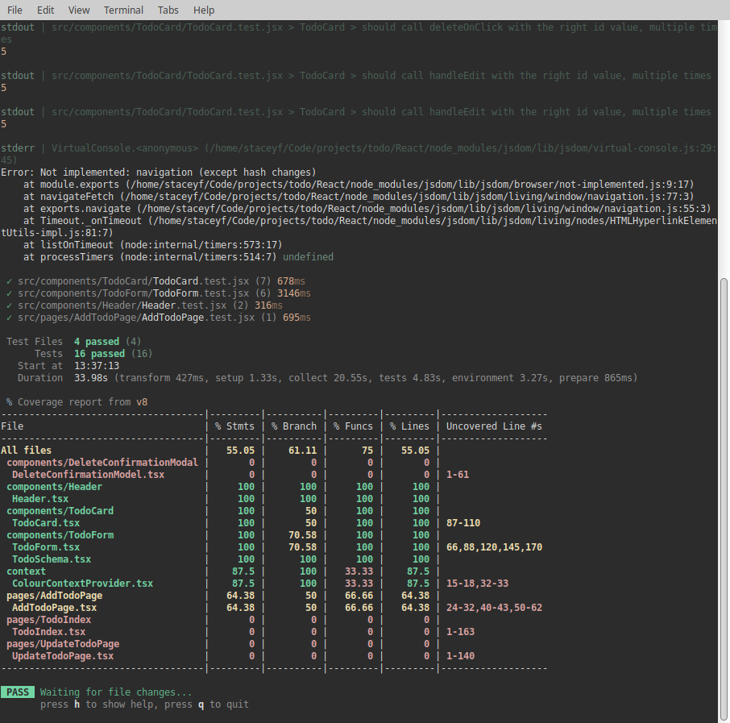

# Welcome to SpringTasker

A Typescript React front end todo app. I originally created a springboot back-end in Spring Boot with a mySQL database but recently working on a Flask backend as an alternate.

  

## Build Steps

1. Clone the repo.
2. Run npm install to install the relevant dependencies.
3. Navigate into /React and start the frontend via `npm run dev`.
4. Tests can be run in /React with `npm run test`.

## About

SpringTasker is a full-stack application that lets you keep track of all your todos with unique color categorization to make it easier to see your most urgent tasks.

## Key Features:

### Front end

1. **Full CRUD:** Users are able to create, read, update and delete new todos
2. **Persisting todo:** Powered by mySql, users are able to have their todos persist between sessions
3. **Todo colour categorization:** Users can categorize their todos by color to easily identify the most pressing tasks
4. **Todo Status:** Users can mark todos as complete to cross them off
5. **Component Testing:** Components have a range of tests to ensure elements render as expected

## Key Learning Highlights

1. **Form validation:** Navigating form validation with Zod and React Hook Form with the integration of MUI components. Explored the Controller wrapper as a way of surfacing form state to the MUI component.
2. **React Testing Library:** Understanding how to mock functions with vi.fn() and utilize React Router DOM's MemoryRouter to mock URLs for navigation testing

## To-Dos

1. **Additional testing:** Introducing more tests across the page components to ensure the validity of the loading skeleton and error messages.

## Screenshots

| New Todo form                           | Update Todo form                           | Test                             |
| --------------------------------------- | ------------------------------------------ | -------------------------------- |
|  |  |  |

## Technologies Used

